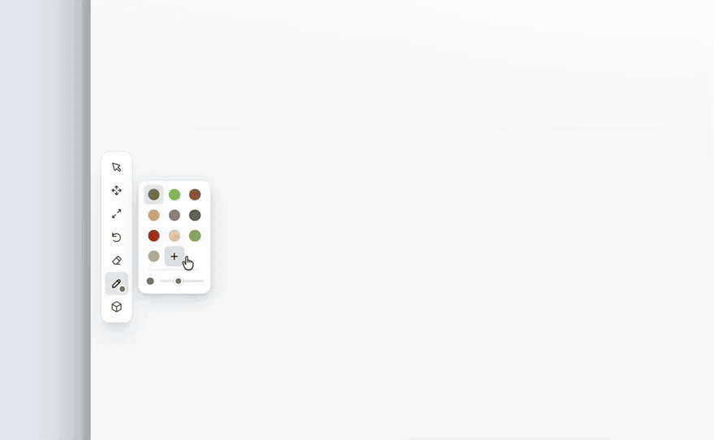

**Build anything, bring it to life.**

Sketch a world with simple 3D shapes, describe the look, and turn it into a detailed Gaussian splat you can explore in your browser.

[Try WorldSplat](https://worldsplat.app) · [Watch the trailer](.github/assets/worldsplat-trailer.mp4) · [Run locally](#run-locally)

[](.github/assets/worldsplat-trailer.mp4)

## Make a world

1. **Block it out.** Paint the ground and arrange shapes, or start from one of four example scenes.
2. **Give it a look.** Write a prompt and generate a detailed 3D splat from your scene.
3. **Explore and keep building.** Move around the result, try another version, and save your worlds to your account.

| Feature | What you can do |
| --- | --- |
| **Browser editor** | Build, paint, and adjust your scene without installing anything. |
| **Separate workspaces** | Keep blockouts and generated splats in their own tabs. |
| **Saved worlds** | Sign in with Google and save with Ctrl/Cmd + S. |
| **Session exports** | Download splats and primitives together as a ZIP, then load them back into the editor. |

## Run locally

The frontend is a static site with no build step. To work on the editor:

```sh
python3 -m http.server 3000 --directory client
```

Open [localhost:3000/app/](http://localhost:3000/app/). You can edit without signing in; signed-out changes last until reload. Saving to an account and generating splats require the backend.

For the full app, follow the [backend setup](server/README.md#run). It requires Go 1.26+, PostgreSQL, Redis, Temporal, Google sign-in, and access to the image and splat providers. The Go server serves both the client and API at [localhost:8067](http://localhost:8067).

<details>
<summary>Use the hosted backend for frontend development</summary>

Serve the client on **port 8080** to connect to `https://worldsplat.app`, then open [localhost:8080](http://localhost:8080/) to sign in. Saves and generations use your live account. Add `http://localhost:8080` to Google's Authorized JavaScript origins and the backend's `WS_ALLOWED_ORIGINS` before using this mode.

</details>

## Under the hood

WorldSplat renders your blockout, details the image through fal, then reconstructs it with TripoSplat. A Go backend runs generation jobs through Temporal, stores worlds in PostgreSQL, and manages sessions in Redis.

| Code | Purpose |
| --- | --- |
| [`client/`](client/) | Static editor and splat viewer, built with JavaScript and Three.js. |
| [`server/`](server/) | Go API, generation worker, authentication, and storage. |

See the [backend README](server/README.md) for configuration, API endpoints, and deployment details.

<details>
<summary>Tests</summary>

```sh
(cd server && go test -race ./...)
npm ci
npm test
npx playwright install --with-deps chromium
npm run test:browser
```

</details>

<details>
<summary>Self-hosting</summary>

Configure `server/.env` using the [backend setup](server/README.md#run), then:

```sh
docker build -t worldsplat .
docker run --rm -p 8067:8067 --env-file server/.env -e WS_ADDR=:8067 -v worldsplat-data:/app/output worldsplat
```

Dependency addresses must be reachable from inside the container; `127.0.0.1` refers to the container itself.

For a separate Vercel frontend, configure the variables in [`.env.example`](.env.example), deploy with `npx vercel deploy --prod`, and add its origin to the backend's `WS_ALLOWED_ORIGINS`. Add each frontend's exact origin to Google's Authorized JavaScript origins; sign-in uses a popup and needs no redirect URI or Google client secret.

</details>
